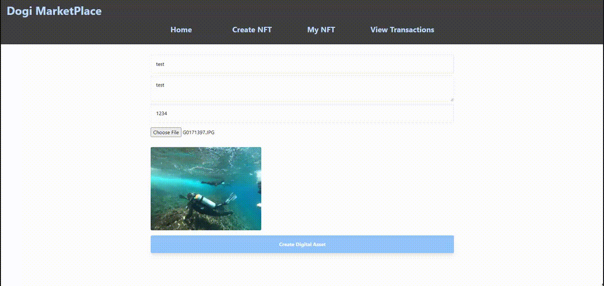

# Dogi_Marketplace

An NFT Marketplace project using: React, JS, Solidity and Tailwind CSS

To Run open 2 consoles:

1) Run : Npm Install
2) Run in one : npx hardhat node
3) Run: npx hardhat test
4) On the other one : npx hardhat run scripts/deploy.js --network localhost
5) Take the private key from one of the wallets in the console and add to your meta mask
6) Then run: npm run dev

 
